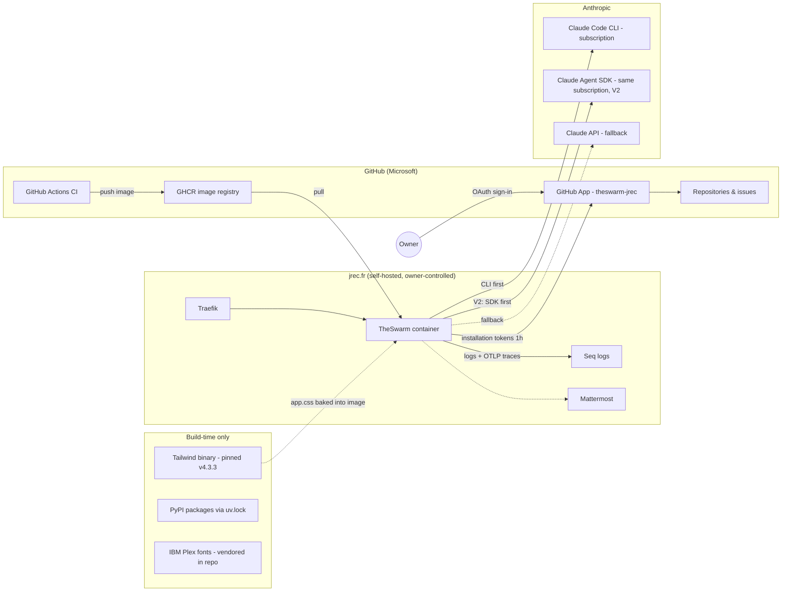

# External dependencies

Every external dependency is a shared decision (owner rule). This map is the
at-a-glance view: who controls it, what it costs, what credential it holds,
how replaceable it is, and whether the decision is settled.

| Dependency | Controlled by | Cost | Credential | Risk | Replaceable by | Decision |
|---|---|---|---|---|---|---|
| GitHub (repos, issues, PRs) | Microsoft | free tier | — | platform lock-in, core to product | GitLab port (large) | ✔ settled (core) |
| **GitHub App `theswarm-jrec`** | **Owner's account** | free | private key + client secret, in Fernet vault | key leak → repo write access on installed repos only | static `GITHUB_TOKEN` (documented fallback) | ✔ owner, 2026-09-01 |
| GitHub Actions + GHCR | Microsoft | free tier | `GITHUB_TOKEN` (ephemeral) | CI outage blocks deploys | self-hosted runner exists | ✔ settled |
| Claude Code CLI (subscription) | Anthropic | owner's Max plan | OAuth session mounted in container | session expiry (seen 3×) → cycles fail | Claude API | ✖ retired in V2 M7 (2026-09-25): the SDK's bundled binary replaced it, Node left the image |
| Claude API | Anthropic | per-token | `ANTHROPIC_API_KEY` | spend without cap if primary silently fails | none (fallback) | ✔ settled |
| **Claude Agent SDK** (`claude-agent-sdk`, PyPI) | Anthropic | owner's Max plan (same identity as the CLI: `CLAUDE_CODE_OAUTH_TOKEN`, else the mounted session) | none of its own | the wheel bundles a 217 MB Claude Code binary (image size); Anthropic's terms allow *individual* subscription use only — never route other users through it | the Claude API with a usable key (`auto` falls back to it); the CLI backend was retired in M7 | ✔ owner, 2026-09-22 (V2 runtime, decision 1) |
| `opentelemetry-sdk` + `opentelemetry-exporter-otlp-proto-http` (+ protobuf, requests) | OSS (CNCF) | free | reuses `SEQ_API_KEY` | supply chain (pinned in uv.lock); exports only to Seq, already a dependency — no new service | log lines alone (spans off when `SEQ_URL` is unset) | ✔ owner, 2026-09-22 (V2 runtime, M2) |
| GitHub repository webhook (V2 M8) | Owner's repos on GitHub | free | `SWARM_WEBHOOK_SECRET` (repo secret → `.env`; the webhook on GitHub signs with the same value) | a public route, HMAC-checked; owner-only, rate-limited; off without the secret | ▶ Play in the UI (no webhook) | ✔ owner, 2026-09-22 (V2 runtime, M8) — the owner creates the webhook (issues, issue_comment) by hand |
| semgrep (PyPI, pinned `1.178.0`), run by QA through `uv tool run` | Semgrep Inc. (OSS engine, LGPL) | free | — | a ~71 MB wheel downloaded once into the uv cache on the data volume; `--config=p/owasp-top-ten` fetches the rules from semgrep.dev at each run; `--metrics=off` | skip the scan (`SWARM_QA_SEMGREP=0`) — the report then says `not_run` | ⏳ proposed by the agent 2026-09-25 (QA's scan never ran in prod: semgrep was not in the image) — owner to confirm |
| `uv` binary, at runtime | Astral (OSS) | free | — | already in the build stage; now copied into the image to build the target's venv (`uv venv --seed`) — falls back to `python -m venv` when absent | `python -m venv` (slower) | ✔ owner, 2026-09-22 (V2 runtime, M5) |
| `langgraph-checkpoint-sqlite` (+ `sqlite-vec`) | OSS (LangChain) | free | — | supply chain (pinned in uv.lock); its own SQLite file, never the app's shared connection | LangGraph's in-memory saver (loses durability) | ✔ owner, 2026-09-22 (V2 runtime, decision 2) |
| Mattermost `chat.jrec.fr` | Owner | self-hosted | bot token | low — optional surface | disconnect | ⚠ 404 on boot, fix-or-drop pending — the host is right (Traefik router `Host(chat.jrec.fr)`), but service `mattermost_mattermost` has run no task since ~2026-05 (last task shut down, earlier ones failed unhealthy), so Traefik answers its own 404; the harness alert fails the same way (read 2026-09-24) |
| Seq `logs.jrec.fr` | Owner | self-hosted | API key | low | stdout logs | ✔ settled |
| Tailwind standalone binary | Tailwind Labs | free, MIT | — | build-time fetch from GitHub releases (pinned + no runtime presence) | hand-rolled CSS | ✔ owner, 2026-09-01 (V2 UI) |
| IBM Plex fonts | IBM (OFL) | free | — | none — woff2 vendored in repo, no CDN | system fonts | ✔ owner, 2026-09-01 (V2 UI) |
| PyJWT + cryptography | OSS | free | — | supply chain (pinned in uv.lock) | — | ✔ owner, 2026-09-01 (App auth) |

**Not dependencies (by design):** no runtime CDN (fonts and CSS ship in the
image), no third-party analytics, no external database.
