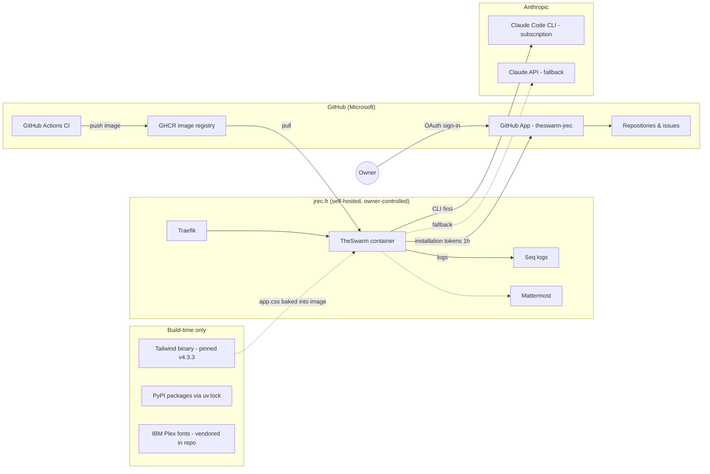

# External dependencies

Every external dependency is a shared decision (owner rule). This map is the
at-a-glance view: who controls it, what it costs, what credential it holds,
how replaceable it is, and whether the decision is settled.

| Dependency | Controlled by | Cost | Credential | Risk | Replaceable by | Decision |
|---|---|---|---|---|---|---|
| GitHub (repos, issues, PRs) | Microsoft | free tier | — | platform lock-in, core to product | GitLab port (large) | ✔ settled (core) |
| **GitHub App `theswarm-jrec`** | **Owner's account** | free | private key + client secret, in Fernet vault | key leak → repo write access on installed repos only | static `GITHUB_TOKEN` (documented fallback) | ✔ owner, 2026-09-01 |
| GitHub Actions + GHCR | Microsoft | free tier | `GITHUB_TOKEN` (ephemeral) | CI outage blocks deploys | self-hosted runner exists | ✔ settled |
| Claude Code CLI (subscription) | Anthropic | owner's Max plan | OAuth session mounted in container | session expiry (seen 3×) → cycles fail | Claude API | ✔ settled |
| Claude API | Anthropic | per-token | `ANTHROPIC_API_KEY` | spend without cap if primary silently fails | none (fallback) | ✔ settled |
| Mattermost `chat.jrec.fr` | Owner | self-hosted | bot token | low — optional surface | disconnect | ⚠ 404 on boot, fix-or-drop pending |
| Seq `logs.jrec.fr` | Owner | self-hosted | API key | low | stdout logs | ✔ settled |
| Tailwind standalone binary | Tailwind Labs | free, MIT | — | build-time fetch from GitHub releases (pinned + no runtime presence) | hand-rolled CSS | ✔ owner, 2026-09-01 (V2 UI) |
| IBM Plex fonts | IBM (OFL) | free | — | none — woff2 vendored in repo, no CDN | system fonts | ✔ owner, 2026-09-01 (V2 UI) |
| PyJWT + cryptography | OSS | free | — | supply chain (pinned in uv.lock) | — | ✔ owner, 2026-09-01 (App auth) |

**Not dependencies (by design):** no runtime CDN (fonts and CSS ship in the
image), no third-party analytics, no external database.
