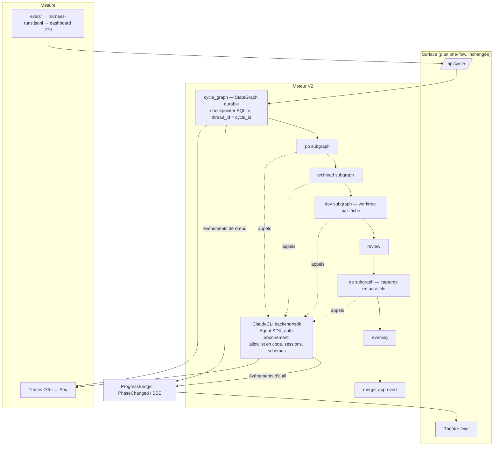

# V2 — le moteur (runtime)

Statut : **plan courant**, aux côtés de `2026-09-v2-one-flow.md`.
Le plan one-flow a livré la surface (sign in → repo → composer → ▶ Play →
théâtre). Ce document spécifie le moteur qui tourne derrière : la façon
dont les quatre agents appellent Claude, la durabilité d'un cycle, son
isolation, sa mesure. Les deux forment V2.

Lecteur cible : l'agent qui implémente. Il est capable de réfléchir et de
s'adapter. Ce document lui dit **ce qu'on veut, pourquoi, ce qui est
non négociable, et comment on saura qu'un jalon est livré**. Il ne lui
dit pas comment nommer ses modules. Quand la spec et la réalité se
contredisent, l'agent tranche, note l'écart dans la PR sous « Écarts à la
spec », et continue. Il ne s'arrête que devant une décision listée en
section 8.

---

## 0. Décisions prises (owner, 2026-09-22)

1. **Le Claude Agent SDK remplace le sous-processus `claude -p`.** Usage
   individuel, sur les repos du owner, authentifié par l'abonnement. La
   doc Anthropic (`code.claude.com/docs/en/legal-and-compliance`,
   vérifiée le 2026-09-22) le prévoit : « Advertised usage limits for Pro
   and Max plans assume ordinary, individual usage of Claude Code and the
   Agent SDK. » Ce que la même page interdit, et que V2 ne fera pas :
   offrir un login claude.ai à des tiers, router les requêtes d'autres
   utilisateurs sur l'abonnement du owner, stocker leurs credentials.
   Le multi-utilisateur, s'il arrive un jour, sera « apporte ta clé ».
2. **LangGraph reste, et sert enfin à quelque chose.** Pas de Temporal, pas
   de service d'orchestration hébergé. La durabilité vient du checkpointer
   LangGraph sur SQLite.
3. **Aucun nouveau service à héberger.** SQLite, Seq, Mattermost, GitHub,
   c'est tout. Un nouveau paquet PyPI est une ligne dans
   `docs/DEPENDENCIES.md` avant de partir en prod.
4. **Chaque jalon est livré séparément** : PR, CI verte, merge, déploiement,
   re-vérification en prod par un vrai cycle. Un jalon non vérifié en prod
   n'est pas livré.
5. **La V1 n'est pas supprimée.** Seul le code mort sans référence ni test
   peut disparaître, et seulement au jalon M7.

---

## 1. Diagnostic — ce qui motive V2

Constats faits sur le code le 2026-09-22 (commit `8fee720`) :

- LangGraph (1.1.6 verrouillé, pin `>=0.2`) ne sert qu'à l'intérieur de
  chaque agent : quatre `StateGraph(AgentState)` dans `agents/{po,techlead,
  dev,qa}.py`, recompilés à chaque appel. L'orchestration entre agents est
  impérative dans `cycle.py` (`_run_phase`, `_announce`, boucle `for` sur
  les itérations Dev). Aucun checkpointer, aucun `interrupt`, aucun `Send`,
  aucun streaming.
- Le modèle n'est jamais appelé via LangChain. `AgentState.llm` est réservé
  et inutilisé. L'appel réel est `claude -p --output-format json` dans
  `tools/claude.py` (699 lignes de harness maison : floors de timeout,
  récupération d'auth, détection de quota, repli API, parsing d'enveloppe,
  repli `--- FILE:`).
- Chaque agent fait 1 à 2 appels Claude par graphe ; le reste des nœuds est
  déterministe (git, pytest, Playwright, GitHub). Le vrai agent, celui qui
  lit et édite, c'est Claude Code. TheSwarm est le workflow autour.
- Le tracker de cycles est en mémoire (#5). Le resumer actuel
  (`application/services/cycle_resumer.py`) reprend à la granularité de la
  phase via `on_checkpoint` / `resume_from`, une fois, trois par boot.
- Les verdicts et les claims sont extraits par regex (`_DECISION_RE`,
  `_FENCE_RE`, `ALREADY_SATISFIED_RE`) ; #126 est le bug de cette classe.
- Le théâtre reconstruit le graphe des phases à partir des annonces et de
  `PHASE_OWNER` (`application/services/progress_bridge.py`) : une phase
  nouvelle qui n'est pas déclarée aux deux endroits est invisible.
- L'allowlist Bash de l'agent Dev est le `~/.claude/settings.json` de
  l'hôte, monté dans le conteneur (`docker-compose.yml`). Les hooks de
  l'hôte se déclenchent dans `claude -p` (mémoire : ils ont annulé des
  revues).
- Pas d'isolation : python système partagé pour installer et tester la
  cible, un workspace par repo, un cycle par repo. Deux sous-tâches
  parallèles se sont effacées l'une l'autre (`16f3b8af2cca` /
  `2878898cc504`).
- Observabilité : logs structurés vers Seq, coût par cycle. Pas de trace
  par nœud ni par appel.
- Mesure : un harness quotidien (`.github/workflows/harness.yml` +
  `scripts/cycle_e2e.py`), une feature, pass/fail et nombre de PR.

---

## 2. Cible

Ce qui **ne change pas** : les événements de domaine (`PhaseChanged`,
`CycleCancelled`…), le contrat du théâtre (`/c/{id}/stage`,
`get_phase_history`), les conventions GitHub (labels, `Parent: #N`,
marqueurs de commentaires), le mode stub, la persistance dans `cycles`,
le verrou par repo, le timeout dur de cycle dans `api.py`, l'auth wall.

---

## 3. Invariants (non négociables)

Ces règles existent parce que chacune a déjà coûté un cycle en prod. Elles
sont vraies avant, pendant et après chaque jalon.

- **I1. L'abonnement est la seule identité en prod.** En prod, c'est la
  session `~/.claude` de l'hôte, montée dans le conteneur et rafraîchie par
  le binaire lui-même ; sur un portable ou en CI, c'est
  `CLAUDE_CODE_OAUTH_TOKEN`. Le déploiement **n'embarque pas** le token
  d'env : un token périmé passe devant la session valide et a fait tomber
  la prod deux fois (`test_the_deploy_no_longer_ships_the_override`). Le
  processus qui appelle Claude ne reçoit **jamais** `ANTHROPIC_API_KEY`
  (rang 3 de la précédence, devant la session et le token, il bascule
  silencieusement la facturation). Le mode `--bare` ne lit pas le token :
  interdit. Le repli API reste possible uniquement sur
  `SWARM_CLAUDE_BACKEND=api` explicite.
- **I2. Les réglages de l'hôte n'entrent pas dans l'agent.** Aucun
  `settings.json`, hook ou skill du niveau utilisateur monté depuis l'hôte
  n'est chargé par un appel SDK. L'allowlist d'outils et les refus vivent
  dans le code de TheSwarm et sont testés.
- **I3. L'arbre de travail est la vérité.** `commit_all` décide ; un
  `already_satisfied` ne compte que sur un arbre propre après commit ; le
  dernier message de Claude n'est qu'un résumé.
- **I4. Toute clé retournée par un nœud est déclarée dans le schéma d'état**
  (`AgentState`, et le futur `CycleState`). Le garde
  `tests/test_agent_state_schema.py` s'étend à tout nouvel état.
- **I5. Un cycle par repo à la fois** (`cycle.repo_lock`). Sur `SELF_REPO`,
  le TechLead approuve et ne merge jamais.
- **I6. Un appel Claude qui échoue est une étape sautée, pas un cycle
  perdu.** Seule `ClaudeFatalError` (fenêtre d'abonnement épuisée) arrête
  le cycle. Un timeout est réessayé avec plus de place ; un échec d'auth
  est réessayé une fois sans le token d'env.
- **I7. Les budgets de phase sont des invariants testés**
  (`test_review_budget_fits_its_phase.py`,
  `test_dev_iteration_budget.py`, `test_persisted_timeout_floor.py`).
  Un jalon qui déplace une phase déplace les tests avec elle, jamais les
  nombres sans preuve.
- **I8. Aucun test ne touche l'API, le SDK ou GitHub en vrai.** Le mode stub
  reste le défaut des tests ; un backend SDK est simulé. Les assertions sur
  argv git ne sont jamais positionnelles.
- **I9. Aucun nouveau chemin d'écriture sur `main` sans son entrée dans
  `paths-ignore` de `ci.yml`.** Sinon le PO redéploie le service et tue le
  cycle.
- **I10. `/health` reste borné à 1 s** et aucun nouvel appel DB non borné
  n'entre dans un chemin de liveness. Le checkpointer LangGraph n'utilise
  **pas** la connexion aiosqlite partagée de l'application.
- **I11. `static/v2/app.css` est généré et jamais commité.**
- **I12. Une dépendance externe nouvelle a sa ligne dans
  `docs/DEPENDENCIES.md`** dans la même PR qui l'introduit.
- **I13. Le rollback existe à chaque jalon.** Tant que M7 n'a pas eu lieu,
  `SWARM_CLAUDE_BACKEND=cli` redonne le comportement d'avant.

---

## 4. Règles de travail pour l'agent qui livre

1. Lire `AGENTS.md` et `CLAUDE.md` en entier avant le premier jalon. Les
   « operational landmines » sont la mémoire des cycles passés.
2. Un jalon = une branche, une ou quelques PR, chacune verte en CI. Jamais
   de push sur `main`. Auto-merge est désactivé : `gh pr merge --squash`.
3. Après `agents/*.py` : `uv run pytest tests/test_agent_state_schema.py -p
   no:playwright` en premier. Après `templates/v2/**` ou `input.css` :
   `bash scripts/build-css.sh`.
4. Déployer, attendre que le **conteneur qui tourne** porte le SHA de
   `main` (`docker inspect`, pas la spec du service), puis vérifier par un
   vrai cycle sur `jrechet/concert-tour-app` via `POST /swarm/api/cycle`
   ou `scripts/cycle_e2e.py`. Lire la timeline dans le théâtre et Seq.
5. Chaque landmine découverte pendant un jalon va dans `AGENTS.md` dans la
   même PR, au même format : le fait, le cycle qui l'a montré, la règle.
6. Chaque écart à ce document est listé dans le corps de la PR sous
   « Écarts à la spec », avec la raison. Un écart argumenté vaut mieux
   qu'un respect aveugle.
7. Une décision de la section 8 rencontrée en cours de route : appliquer
   le défaut indiqué, écrire un handoff dans `docs/handoffs/`, continuer.
8. Ne pas déployer pendant qu'un cycle tourne sur `SELF_REPO` ou pendant le
   harness de 07:00 UTC.

---

## 5. Jalons

Chaque jalon donne : but, périmètre, spécification, critères d'acceptation,
liberté laissée, pièges connus. L'ordre est celui des dépendances ; M2 peut
passer avant M1 si l'agent préfère mesurer d'abord.

### M0 — Sonde SDK en prod

**But.** Prouver dans le conteneur de prod que le SDK s'exécute et
s'authentifie par l'abonnement, avant de toucher au pipeline.

**Périmètre.** Dépendance `claude-agent-sdk` (pin sur la version mineure
testée), pin `langgraph>=1.1`, ligne `DEPENDENCIES.md` (Anthropic, PyPI,
identité abonnement, remplaçable par retour au CLI). Une vérification dans
`python -m theswarm validate` qui : localise le binaire (embarqué dans le
wheel ou sur `PATH`), lance une `query()` triviale (`max_turns=1`,
`allowed_tools=[]`), et rapporte modèle, `session_id`, coût, et **quelle
identité a répondu**. Aucun changement de comportement des cycles.

**Spécification.**
- L'environnement passé au SDK est construit explicitement (option `env`)
  et exclut `ANTHROPIC_API_KEY` (I1). Un test unitaire couvre ce filtrage.
- `setting_sources` est explicite et n'inclut jamais `user` (I2).
- Le SDK ne lit pas `.env` ; l'application charge le sien comme aujourd'hui.
- L'identité de prod reste la session `~/.claude` montée depuis l'hôte,
  que le SDK lit exactement comme le CLI. Le token d'env n'entre **pas**
  dans la chaîne de déploiement (voir I1) ; il sert aux runs locaux.

**Acceptation.**
- `validate` en prod rapporte le SDK OK et l'identité abonnement.
- Le harness du lendemain passe comme avant (aucune régression).

**Pièges.** Le wheel peut ne pas embarquer de binaire sur certaines
plateformes ; dans ce cas `cli_path` pointe sur le binaire npm déjà
installé par le `Dockerfile` (vérifié le 2026-09-23 : le wheel
`manylinux_2_17_x86_64` embarque un binaire de 217 Mo). Le `~/.claude`
monté contient la session qui s'auto-rafraîchit à chaque appel ; si elle
meurt, le owner se reconnecte sur l'hôte, comme aujourd'hui.

### M1 — Backend `sdk` derrière `ClaudeCLI`

**But.** Remplacer le sous-processus par le SDK sans changer l'interface
que les agents utilisent, et donner au théâtre les événements d'outils en
direct.

**Périmètre.** `tools/claude.py` : un backend `sdk` sélectionnable par
`SWARM_CLAUDE_BACKEND` ; `auto` devient `sdk → cli → api`. `ClaudeResult`
gagne `session_id` et `backend="sdk"`. Le bridge reçoit les événements
d'outils. `Dockerfile` et `docker-compose.yml` ajustés au strict nécessaire.

**Spécification.**
- **Parité de contrat.** `run`, `run_tests`, `for_task`, le routage de
  modèles par alias (`sonnet` → `claude-sonnet-5`), `_timeout_floor` et
  sa persistance, `ClaudeFatalError` sur quota, la récupération d'auth :
  tout est conservé et testé avec le backend `sdk` simulé.
- **Timeout = reprise, pas re-prompt.** Un appel qui dépasse son budget
  est repris par `resume=session_id` avec un prompt court (« l'arbre
  contient déjà tes modifications, termine et arrête-toi »), dans la
  logique de floor existante. Le re-prompt à froid n'est utilisé que si la
  session n'existe plus.
- **Permissions en code.** Par catégorie d'appel : implémentation et Ralph
  = `permission_mode="acceptEdits"` avec `Read/Edit/Write/Glob/Grep/Bash` ;
  revue et breakdown = lecture seule `Read/Glob/Grep` ; plan, rapport,
  génération E2E = ce que l'agent juge utile, jamais `Bash` en écriture
  hors workspace. **La politique est un hook `PreToolUse`** (mesuré en
  M1 : un outil dans `allowed_tools` est approuvé avant `can_use_tool`, et
  les lectures dans le projet ne demandent rien ; seul un hook voit chaque
  appel) ; elle refuse tout chemin hors du workspace, `git push`, `gh`, la
  lecture de `.env`, l'écriture dans `.git/config`. `WebSearch`/`WebFetch`
  désactivés sauf besoin motivé. `setting_sources` vide : voir section 8.
- **Bornes.** Un `max_turns` par catégorie (valeur généreuse, configurable)
  pour qu'un appel ne boucle pas jusqu'au timeout de phase.
- **Théâtre.** Chaque appel d'outil produit au plus un événement
  `on_progress(role, …)` (nom d'outil + résumé court : chemin, commande
  tronquée), chaque bloc de texte assistant au plus un. Jamais de contenu
  de fichier, jamais de secret (réutiliser le scrub existant). Le panneau
  live ne doit pas être inondé : un cycle Dev de 30 min reste lisible.
- **Coût.** `total_cost_usd` et `usage` de `ResultMessage` alimentent le
  tracker par appel comme aujourd'hui.
- **Repli `--- FILE:`.** Conservé, mais chaque déclenchement est compté et
  loggé. Ce compteur décide de sa suppression en M7.
- **Tests.** Le SDK est simulé par un générateur asynchrone de messages
  (`SystemMessage`, `AssistantMessage`, `ResultMessage`). Les tests
  existants sur le backend `cli` restent.

**Acceptation.**
- Suite verte, backends `cli` et `sdk` couverts.
- En prod avec `SWARM_CLAUDE_BACKEND=sdk` : **trois cycles consécutifs**
  du harness sur concert-tour-app, chacun avec une PR ; le théâtre montre
  les appels d'outils du Dev ; le coût par appel est non nul ; Seq montre
  l'identité abonnement.
- Alors seulement, `auto` prend `sdk` en premier. Le retour à `cli` par env
  est vérifié une fois en prod (I13).
  *Livré le 2026-09-24* : trois runs consécutifs du harness, verts, sur
  `sdk`, chacun avec ses PR — `c314a7ee3bf5` (chronological order, 3 PR),
  `5544340c96cb` (sold-out badge, repris après le déploiement d'un merge
  en plein cycle, 2 PR), `1ab66ead498d` (compte à rebours, 2 PR). Avant
  eux, deux runs rouges sans rapport avec le SDK : `04fc7fff85a0` perdu à
  la course arrêt/annulation (#194) et `874f575645f2`, une feature déjà
  livrée (#196). Le retour à `cli` : un appel en prod avec
  `SWARM_CLAUDE_BACKEND=cli`, servi par Claude Code 2.1.197 (2026-09-23).
  `auto` devient `sdk → cli → api` : un quota reste fatal, un timeout déjà
  dépensé par le SDK (`SDKTimeoutError`) n'est pas redépensé sur la CLI.

**Liberté.** Structure du module (un fichier de plus ou un paquet
`tools/claude/`), forme de l'objet permissions, choix entre `query()` et
`ClaudeSDKClient`, valeurs de `max_turns`.

**Pièges.** Le SDK écrit son état de session sous `~/.claude` du
conteneur : ce répertoire doit être inscriptible et, idéalement, sur le
volume persistant (voir M4). L'ancien bug « `claude -p` pend 90 s » avait
son garde-fou : garder un timeout externe autour de l'itération SDK, pas
seulement `max_turns`.

### M2 — Traces OpenTelemetry vers Seq

**But.** Voir un cycle comme un arbre : phases, nœuds, appels Claude, avec
coût et durée, dans l'outil déjà en place.

**Spécification.**
- Une trace par cycle ; son `trace_id` est stocké sur la ligne `cycles` et
  le théâtre affiche un lien vers Seq.
- Un span par phase et par nœud de graphe ; un span par appel Claude avec :
  backend, modèle, `session_id`, tokens entrée/sortie, coût, durée,
  `num_turns`, nombre d'appels d'outils, `subtype` du résultat, floor de
  timeout appliqué, reprise ou non.
- Export OTLP/HTTP vers Seq (`SEQ_URL`, clé `SEQ_API_KEY`). Les logs
  structurés existants portent `trace_id` et `span_id`.
- Aucun service nouveau. Paquets `opentelemetry-*` : une ligne
  `DEPENDENCIES.md`.

**Acceptation.**
- Dans Seq, un cycle de prod apparaît comme un arbre lisible.
- La somme des coûts des spans d'appel égale le coût du cycle enregistré,
  à l'arrondi près (test unitaire avec exporteur en mémoire).

**Pièges.** Vérifier sur la machine que la version de Seq installée
accepte OTLP (endpoint `/ingest/otlp/v1/traces`). Si non, c'est une
décision owner (section 8) : handoff, et export vers les logs en attendant.

### M3 — Sorties structurées

**But.** Aucune décision de code n'est plus prise en lisant de la prose.

**Spécification.**
- Tout appel dont la sortie est consommée par du code déclare un schéma :
  breakdown TechLead (sous-tâches : titre, corps, labels), verdict de revue
  (`decision` ∈ {APPROVE, COMMENT, REQUEST_CHANGES}, résumé, `issues[]`),
  claim du Dev (`status` ∈ {implemented, already_satisfied, blocked},
  raison). Les sorties pour humains (plan, rapport du PO, rapport de démo)
  restent en markdown.
- Mécanisme : `output_format={"type": "json_schema", "schema": …}` du SDK,
  schémas Pydantic (draft‑07) versionnés dans le code de TheSwarm. Un
  résultat `error_max_structured_output_retries`, ou `success` sans
  `structured_output`, est un **appel échoué** : traité comme un appel
  optionnel raté (I6), jamais deviné.
- `_DECISION_RE`, `_FENCE_RE` et `ALREADY_SATISFIED_RE` ne décident plus
  rien dès qu'une structure existe ; ils restent le repli du backend
  `cli` jusqu'à M7 (I13 : le rollback existe tant que M7 n'a pas eu lieu —
  écart tranché en M3, 2026-09-23) et partent avec lui. La règle
  « l'arbre est commité avant de croire un already_satisfied » (I3) reste.
- Un verdict REQUEST_CHANGES continue de fermer la boucle exactement comme
  aujourd'hui (`CHANGES_MARKER`, retour en `status:ready`,
  `resume_branch`, `CHANGES_REQUESTED_CAP`).

**Acceptation.** Un cycle de prod avec un REQUEST_CHANGES puis une reprise
sur la même branche ; un cycle avec un `already_satisfied` correctement
fermé ; plus aucune regex de verdict dans `agents/`.

**Pièges.** Un schéma trop profond fait échouer la validation : garder les
schémas plats et les champs incertains optionnels. Le `format` JSON Schema
n'est pas validé par le SDK.

### M4 — Graphe durable

**But.** Un cycle survit à un redéploiement et reprend au nœud suivant, sans
dupliquer ses effets de bord. Le théâtre lit le graphe au lieu de le
reconstruire.

**Spécification.**
- **Un supergraphe `cycle_graph`** remplace le corps impératif de
  `run_cycle`. Nœuds : `po_morning`, `techlead_breakdown`, `dev_iter`
  (boucle par arête conditionnelle et compteur dans l'état, plafond
  `MAX_DEV_ITERATIONS` inchangé), `techlead_review`, `qa`, `po_evening`,
  `merge_approved` (fin de cycle, #173), `retrospective`. Les quatre
  graphes d'agents deviennent des sous-graphes, compilés une fois par
  processus. Chaque nœud garde son budget `PHASE_TIMEOUTS` (I7).
- **État checkpointable.** Un `CycleState` déclaré (I4), **sans objets
  vivants** : les ports (`github`, `claude`, `workspace`) sont fournis par
  la configuration d'exécution ou un registre par processus, pas par
  l'état. Les octets d'artefacts (captures, vidéos) vont sur disque ou en
  base ; l'état ne porte que des références. Un `schema_version` dans
  l'état ; un checkpoint d'une autre version n'est pas repris : le cycle
  passe `failed` avec la raison, proprement, jamais en boucle de crash.
- **Checkpointer** LangGraph SQLite asynchrone, fichier dédié sous
  `~/.swarm-data/`, connexion propre (I10), `thread_id = cycle_id`.
- **Reprise.** Au boot, pour chaque cycle `running` non annulé (#96), le
  graphe est réinvoqué sur son thread et continue depuis le dernier
  checkpoint. Les gardes du resumer actuel restent : une reprise
  automatique au plus par cycle, trois par boot, `triggered_by =
  auto-resume:N`. L'ancien mécanisme (`on_checkpoint`, `resume_from`,
  `_skip`) est retiré quand le nouveau est prouvé, pas avant. *M4
  (2026-09-23)* : `_skip` a disparu, `resume_from` n'est plus qu'un
  drapeau, `on_checkpoint` nourrit encore la page V1 des cycles.
- **Idempotence des nœuds.** Un nœud peut être rejoué après un crash
  survenu entre son effet et son checkpoint. L'agent audite chaque effet
  de bord et ajoute le test manquant : branche (par nom), PR (chercher
  une PR ouverte pour la branche avant d'en créer une), revue (clé
  `number@sha`, déjà là), commentaires (présence du marqueur), labels
  (idempotents), merge (état GitHub), sauvegarde mémoire et rapport du
  jour (dédupliqués par cycle ou par date).
- **Le workspace et l'état de session SDK vivent sur un volume
  persistant** (aujourd'hui `~/.swarm-workspaces` est dans le conteneur,
  donc perdu à chaque redéploiement ; `~/.claude` est monté, donc les
  sessions survivent déjà), pour qu'une reprise après redéploiement
  retrouve l'arbre et, au mieux, la session. Si la session est perdue, le nœud repart à
  froid sur l'arbre existant (I3 rend cela sûr).
- **Théâtre.** `PhaseChanged` est émis depuis les transitions du graphe
  (mode de stream `updates` ou wrapper de nœud), plus depuis `_announce`.
  Le propriétaire d'un nœud est une métadonnée du nœud, exposée par le
  graphe ; `PHASE_OWNER` disparaît. Le rail de phases du théâtre se
  dérive de `cycle_graph.get_graph()` : un nœud nouveau est connu sans
  autre déclaration. Le contrat `/c/{id}/stage` et `get_phase_history`
  ne changent pas.
- **Parallélisme QA.** Captures d'écran, avant/après par story et vidéos
  par story s'exécutent en branches `Send` parallèles, concurrence bornée
  par une config (défaut 2 ; le conteneur a 2 Go). Un échec de lancement
  de la démo fait sauter toutes les branches de capture, comme aujourd'hui.
  *Reporté à M5 (2026-09-23)* : les nœuds de capture écrivent les mêmes
  clés (`demo_launch_error`, `tokens_used`) et `AgentState` n'a pas de
  réducteurs ; en donner change la sémantique d'accumulation de tous les
  graphes. À faire avec l'isolation, où le sous-graphe QA est retouché.
  *Livré (2026-09-25)* sans `Send` ni réducteur : un nœud `captures` lance
  deux voies en `asyncio.gather` — captures d'écran (port `+1`), vidéos
  (port `+2`) — chacune avec son serveur de démo ; les réponses se
  fusionnent (jetons additionnés, première erreur de lancement gardée).
  `SWARM_QA_CAPTURE_CONCURRENCY`, défaut 2 ; à 1, l'ordre d'avant.
- Le verrou par repo et le timeout dur de cycle restent hors du graphe.

**Acceptation.**
- Test automatisé au niveau graphe : nœuds simulés, checkpointer SQLite
  temporaire, interruption entre deux nœuds, reprise → chaque nœud a
  tourné exactement une fois.
- Local, sur un vrai repo : `kill -9` pendant la phase Dev, redémarrage →
  le cycle reprend et termine avec **une** PR, aucun commentaire en double.
- Prod : **un déploiement de TheSwarm pendant un cycle concert-tour-app ne
  le tue plus** ; il reprend sur le nouveau conteneur et finit avec une PR.
  La landmine « anything that commits to main kills that cycle » est
  réécrite dans `AGENTS.md` en « interrupts the cycle for ~2 min ».
  *Acceptation prod (2026-09-23)* : `docker service update --force`
  pendant la phase Dev du cycle `747bb89eced2` (feature « chronological
  order ») ; le nouveau conteneur l'a repris comme `83b584194589` depuis
  la boucle Dev, et il a fini avec trois PR revues et fusionnées, harness
  PASS, 2,81 $. Trois trous trouvés en chemin et bouchés : l'ancien id
  n'était relié à rien (`cycles.resumed_as`, v029 ; le harness et
  `/c/{id}` suivent le lien), chaque cycle s'enregistrait `triggered_by =
  web` (la limite d'une reprise ne tenait pas ; la reprise dit maintenant
  `auto-resume:1`), et le workspace vivait dans le conteneur (volume nommé
  `swarm-workspaces`). Un quatrième après coup : l'arrêt d'un conteneur
  était enregistré comme une annulation, et la reprise dépendait d'une
  course entre la fin de la boucle et le SIGKILL — le cycle `04fc7fff85a0`
  a été perdu au déploiement de #192 (#194 : seule une annulation demandée
  est écrite). La reprise a aussi révélé qu'un Dev pouvait
  installer les dépendances de la cible dans le venv de TheSwarm par son
  propre Bash : chaque enfant Claude reçoit désormais le `.venv-swarm` du
  workspace en tête de PATH, jamais celui de TheSwarm.
  *Suite (2026-09-25, après-midi)* : deux déploiements rapprochés ont tué
  `092596248fb9` puis sa continuation `46ff31375dce`, en QA, après la
  fusion de ses trois PR (#348-#350). Quatre trous, bouchés :
  (1) une fusion faite à vide se déployait dix minutes plus tard en plein
  cycle — l'étape « Wait for running cycles » de `cd.yml` attend
  jusqu'à 30 min (#221 ; sa première version comptait aussi les phases
  restées `running` dans les cycles moissonnés et attendait toujours
  30 min, #225 lit le statut du cycle seul et la moisson ferme la phase
  en vol) ; (2) le lanceur de reprise ne passait pas le dépôt des
  checkpoints de phase — aucune continuation n'en écrivait — et la
  collecte cherchait le fil de graphe d'une continuation sous son propre
  id, alors qu'elle tourne sur celui de son origine (`origin_of`, #224) ;
  (3) un cycle échoué ne disait pourquoi que dans la mémoire du tracker
  (`cycles.error`, v030, écrit par `CycleFailed`, la moisson et
  `record_not_resumed`, #224 — vérifié en prod : les trois cycles
  arrêtés par la fenêtre d'abonnement portent leur erreur) ; (4) il
  coûtait 0 $ (`spent_so_far`, le `total_cost` du checkpoint, #228).

**Liberté.** Découpage en modules, mode de stream, façon de passer les
ports, un fichier SQLite ou une table dédiée dans le fichier principal
tant que la connexion est séparée.

**Pièges.** `attempted_tasks` est aujourd'hui muté en place « pour survivre
à une itération qui lève » : avec un état checkpointé, cette astuce
devient un bug ; le remplacer par un retour d'état explicite. La compilation
du graphe à chaque appel est actuellement ce qui rend l'état stateless :
compiler une fois oblige à sortir tout état du module.

### M5 — Isolation d'exécution

**But.** Deux tâches ne se marchent plus dessus ; la cible n'est plus
installée dans le python système ; deux repos peuvent tourner en même
temps.

**Spécification.**
- **Un worktree git par tâche Dev** sous le workspace (`.worktrees/<branche>`),
  créé depuis `origin/main` ou repris depuis la branche de la PR
  (`resume_branch`). Commit, push et tests s'exécutent dans le worktree.
  Le worktree est retiré après l'ouverture de la PR ; la branche reste.
  Le contexte « PR ouvertes des sœurs » (`_sibling_prs`) reste dans le
  prompt.
- **Sous-tâches parallèles** : deux enfants indépendants en
  `status:ready` peuvent tourner en branches `Send` parallèles du
  sous-graphe Dev, concurrence bornée par config (défaut 1 = comportement
  actuel ; 2 quand prouvé en prod).
- **Interpréteur par workspace** (venv `uv` dans le workspace, ou
  équivalent) pour installer et tester la cible. Ni le venv de TheSwarm
  ni le python système ne sont modifiés par un cycle. Le budget
  d'installation de 300 s est inchangé ; le cas TheSwarm (~63 s à froid)
  est mesuré avant/après.
- La démo QA utilise le même interpréteur isolé et l'environnement
  scrubbé existant (`demo:` de `theswarm.yaml`).
- **Concurrence entre repos** bornée par une config globale (défaut 1 en
  prod tant que la mémoire n'est pas mesurée).
- **Hors périmètre** : un conteneur par cycle via le socket Docker. C'est
  une décision de sécurité du owner (section 8).
- *Livré en deux temps (2026-09-23)* : **M5a** = interpréteur par
  workspace (`uv venv --seed`), artefacts d'exécution exclus via
  `.git/info/exclude` (ferme aussi le trou « `git add -A` commite les
  artefacts »), borne globale `SWARM_MAX_CONCURRENT_CYCLES`. **M5b** (à
  faire) = worktree par tâche, sous-tâches parallèles via `Send`, et le
  parallélisme des captures QA reporté de M4 — les trois demandent des
  réducteurs dans `AgentState` et se livrent ensemble. *M5b, première moitié (2026-09-25)* : un
  worktree par tâche Dev (`tools/git.add_worktree`), le clone reste sur
  main, le worktree partage le `.venv-swarm` du clone ; les sous-tâches
  parallèles et les captures QA parallèles restent à livrer. Le partage du
  venv tient à concurrence 1 : à 2, une installation éditable de l'une
  ferait tester le code de l'autre — chaque worktree aura alors son venv.
  *Sous-tâches parallèles (2026-09-25)* : `SWARM_DEV_PARALLELISM` (défaut
  1) ; au-delà, l'itération Dev lance autant de graphes Dev à la fois, par
  `asyncio.gather` dans le nœud plutôt que par `Send` — les graphes Dev ont
  chacun leur état, aucun réducteur n'est nécessaire côté `AgentState`. Les
  sélecteurs passent un par un et sautent ce qu'un frère a pris ; chaque
  worktree a son venv. Captures QA parallèles livrées le même jour (voir
  M4, « Parallélisme QA »).
  *Acceptation (2026-09-25)* : le cas `16f3b8af2cca` / `2878898cc504` est
  un test sur de vrais dépôts (deux tâches, deux branches, aucun commit
  perdu) ; le `site-packages` de TheSwarm est inchangé après chaque cycle
  depuis #190 ; un cycle de prod à largeur 2 (`9d3174f41829`) a fait deux
  tâches côte à côte, trois PR, harness PASS, puis retour à 1 ; ses deux
  serveurs de démo QA (ports 8001 et 8002) étaient prêts à 9 ms d'écart.
  À surveiller : l'E2E de QA de ce cycle a fini en 24 erreurs, 0 test
  exécuté, là où le run quotidien du matin (largeur 1) en passait 21 ; la
  cause n'a pas pu être lue (le workspace est effacé en fin de cycle, et
  la sortie n'est pas journalisée).
  *Cause trouvée (2026-09-25)* : le fichier E2E est écrit à l'aveugle et
  ne pouvait monter aucun test ; le prompt ne donnait même pas le port
  (`{{port}}` après `.format` restait `{port}`). QA le répare une fois
  quand chaque test échoue au montage (#223). *Dépendances entre
  sous-tâches (#227)* : à largeur 2, les deux premières sœurs prêtes
  partaient ensemble et écrivaient le code l'une de l'autre (#322/#323
  dans `9d3174f41829`, #325 jamais fusionnée). Le découpage nomme
  maintenant ce dont chaque tâche dépend (`depends_on`, positions
  antérieures seulement), le TechLead l'écrit sur l'issue (« Depends on:
  #N ») et les sélecteurs laissent une tâche attendre tant qu'une
  dépendance est ouverte. La largeur 2 ne parallélise donc plus que des
  tâches indépendantes. Sur SELF_REPO, où les PR approuvées fusionnent en
  fin de cycle, une tâche dépendante attend le cycle suivant.

**Acceptation.**
- Test de régression du cas `16f3b8af2cca` / `2878898cc504` : deux tâches
  parallèles → deux branches, deux PR, aucun commit perdu.
- Empreinte du `site-packages` système identique avant et après un cycle.
- Harness vert avec parallélisme 2 sur un cycle de prod, puis retour au
  défaut choisi.

### M6 — Évals et boucle de mesure

**But.** Savoir, chiffres à l'appui, si un changement a rendu le swarm
meilleur ou pire.

**Spécification.**
- Un dossier `evals/` avec un manifeste : cinq features canoniques sur
  concert-tour-app pour commencer, chacune avec le texte, les chemins
  attendus dans le diff (globs), les labels attendus, un coût et une durée
  maximum.
- `scripts/cycle_e2e.py` (ou son successeur) note chaque run : PR ouverte
  (obligatoire), CI de la PR verte, décision de revue, coût, durée,
  chemins touchés conformes, `tests_unavailable` ou non. Le résultat
  s'ajoute à `docs/harness-runs.jsonl` avec les anciens champs conservés.
- Le harness de 07:00 UTC lance **une** feature par jour, en rotation
  (l'abonnement est un budget) ; `workflow_dispatch` lance la série.
- Le dashboard #79 montre les 14 derniers runs : taux de réussite, coût,
  durée, par backend. Un run raté envoie un message Mattermost via la
  persona existante.

**Acceptation.** Le dashboard affiche la tendance ; une régression
volontaire (par exemple `max_turns=1` sur l'implémentation, un jour) est
détectée comme run raté puis annulée.
*Acceptée le 2026-09-25* : `SWARM_SDK_MAX_TURNS_EDIT=1` posé sur le
service (`docker service update --env-add`, #201), un run du harness :
les deux tentatives de l'itération Dev s'arrêtent sur « Reached maximum
number of turns (1) », le run `bd03e92eddbb` est enregistré raté (aucune
PR, trois sous-tâches non construites) et la page du repo le compte dans
« Reliability · last 11 harness runs » ; la variable est retirée aussitôt
après (`--env-rm`). Le run quotidien suivant montre le retour au vert.

**Pièges.** Un cycle d'éval est un vrai cycle : il tient le verrou du repo
et consomme l'abonnement. Ne jamais l'exécuter sur `SELF_REPO` sans
dispatch manuel.

*Livré le 2026-09-23* : `evals/concert-tour-app.yaml` (cinq features),
`theswarm.evals` (rotation, scoring, tendance), le harness scoré, le
panneau « Reliability » sur la page du repo, l'alerte Mattermost. *Écart
constaté en prod le même jour* : la protection de branche de `main` a
refusé la publication directe de `docs/harness-runs.jsonl` à 14:37
(« Changes must be made through a pull request », run 35874015968) puis
l'a acceptée à 15:33 (run 35882035360), même étape, même jeton ; lue à
17:25, elle exige une PR mais ne s'applique pas aux admins. L'image ne
livre de toute façon ce fichier qu'à la construction ; le harness poste
donc chaque run scoré sur `POST /api/evals/runs` (table `eval_runs`) et la
page lit d'abord ce magasin. Les autres écritures d'agents sur `main`
(rapport du jour, mémoire, historique des cycles) passent aujourd'hui
grâce à l'exemption des admins : décision owner à prendre (section 8). Le
critère d'acceptation « une régression volontaire est détectée » est à
exercer en prod (un dispatch `all=true` puis un cycle cassé) après le
déploiement.

*Mesure corrigée (2026-09-25)* : le champ `ci` du harness lisait le
statut `theswarm/review` que le TechLead pose depuis M8 — concert-tour-app
n'a aucune CI, et « CI RED » voulait dire « changements demandés »
(#226). Un run qu'un redémarrage ou la fenêtre d'abonnement a terminé
est `interrupted` : jamais mesuré, jamais une régression, dessiné en
pointillé (#228). Le conteneur de prod partage la fenêtre d'abonnement
avec le Claude Code du owner : deux runs de 12:40 sont morts en huit
secondes dessus. Une PR approuvée ne fusionne que sur une CI verte
(`agents/ci_gate.py`, #226) ; une story se ferme quand sa dernière
sous-tâche fusionne, et un parent se lit exactement (« Parent: #32 »
n'est plus dans « Parent: #321 », #229).

### M7 — Nettoyage

**But.** Retirer ce que V2 a rendu inutile, sans toucher à la V1.

**Spécification.** Après dix cycles consécutifs sur `sdk` sans retour à
`cli` :
- Retirer `_run_cli`, le mode `cli`, et si le binaire embarqué du SDK a
  servi en prod depuis M0, l'installation Node et npm du `Dockerfile`
  (l'image maigrit). Le montage `~/.claude` de l'hôte reste : c'est
  l'identité de prod (I1).
- Retirer le repli `--- FILE:` si son compteur est resté à zéro.
- Retirer l'ancien mécanisme de checkpoint par phase si M4 est prouvé.
- Retirer `infrastructure/llm` (vide), la clé `llm` de `AgentState`,
  et `SkillMCPManager` s'il n'a toujours aucune référence hors tests
  (décision owner par défaut : supprimer ; section 8).
- Chaque suppression est listée dans la PR avec la preuve `grep` d'absence
  de référence. Rien de la V1 (routes, templates, rôles) n'est supprimé.

**Acceptation.** Suite verte, image plus petite, harness vert, `AGENTS.md`
débarrassé des landmines devenues fausses (avec la date).
*Porte franchie le 2026-09-25* : quatorze cycles de prod sur `sdk`
depuis le 2026-09-23, aucun retour à `cli`. *Livré en deux temps* :
**M7a** retire `infrastructure/llm` (vide) et la clé `llm` d'`AgentState` ;
`SkillMCPManager` **reste** — le registre V1 de `/api/features` le cite
(« Skill-Embedded MCPs »), donc il a une référence hors tests et la V1
n'est pas touchée. Le repli `--- FILE:` reste aussi : aucun compteur ne
prouve qu'il n'a jamais servi, et le backend `api` rend du texte. **M7b**
retire le backend CLI et Node/npm de l'image : `_run_cli`,
`_cli_with_auth_recovery` et le lecteur d'enveloppe JSON partent ; `auto`
devient `sdk → api` (l'API seulement avec une clé utilisable) ;
`SWARM_CLAUDE_BACKEND=cli` tourne sur le SDK avec un avertissement ; la
santé et le diagnostic lisent le binaire embarqué du SDK. Les tests propres
à la CLI partent, ce qu'ils gardaient pour les deux backends passe au SDK.
Le chemin de retour depuis le SDK est désormais un revert (I13 tenait
jusque-là).

### M8 — Déclencheurs GitHub natifs (produit)

À faire après M1–M6, l'ordre reste au owner.

**Spécification.**
- Un label (nom à choisir, par exemple `swarm:go`) posé sur une issue
  lance un cycle ciblé, comme ▶ Play. Signature de webhook vérifiée ;
  seul `SWARM_OWNER_LOGIN` déclenche ; rate limit.
- Un commentaire `@swarm <instruction>` du owner sur une PR lance une
  itération Dev sur la branche de cette PR (`resume_branch`) avec
  l'instruction, puis une revue.
- La revue du TechLead est aussi publiée comme GitHub Check sur la PR.
- Une page par repo « ce que le swarm a appris » rend `AGENT_MEMORY.jsonl`
  lisible.

**Acceptation.** Label → cycle visible dans le théâtre en moins de 30 s ;
commentaire → PR mise à jour ; check visible sur la PR.

*Livré le 2026-09-23* : les deux portes (label `swarm:go`, `@swarm
<instruction>` sur une PR, owner seul, une par repo et par minute), le
verdict de revue en **commit status** `theswarm/review` (un PAT ne peut
pas créer de Check run ; le status est visible sur la PR et utilisable
par la protection de branche), la page « what the swarm learned ». La
route ne s'ouvre qu'avec `SWARM_WEBHOOK_SECRET` ; le owner crée le webhook
(événements `issues` et `issue_comment`) sur GitHub avec ce secret.
L'acceptation « en moins de 30 s » se mesure en prod après ce réglage.

---

## 6. Ce que la spec ne fixe pas

Les noms de modules et de classes ; le découpage en PR à l'intérieur d'un
jalon ; `query()` contre `ClaudeSDKClient` ; le mode de stream LangGraph ;
un fichier SQLite dédié contre une table dédiée ; les valeurs par défaut de
`max_turns` et des bornes de concurrence, tant qu'elles sont configurables
et documentées ; la bibliothèque de schémas (Pydantic est déjà une
dépendance) ; l'ordre entre M1 et M2.

---

## 7. Repères dans le code

*Mis à jour le 2026-09-25, après M7.*

| Sujet | Où |
|---|---|
| Wrapper Claude (SDK + API ; la CLI est retirée en M7) | `src/theswarm/tools/claude.py` — `ClaudeCLI.run`, `_sdk_with_recovery`, `_run_sdk`, `decide_tool_use`, `_run_api`, `_timeout_floor`, `ClaudeFatalError`, `SDKTimeoutError` |
| Orchestration (graphe durable depuis M4) | `src/theswarm/cycle_graph.py` — les nœuds, `_run_phase`, `_dev_iter_parallel`, `run_cycle_graph` ; `src/theswarm/cycle.py` — `run_daily_cycle`, `repo_lock`, `cycle_slot` ; `src/theswarm/cycle_budgets.py` — `PHASE_TIMEOUTS` |
| Graphes d'agents | `src/theswarm/agents/{po,techlead,dev,qa}.py` — `build_*_graph()` |
| Schéma d'état | `src/theswarm/config.py` — `AgentState`, `CycleConfig`, `SELF_REPO` |
| Garde du schéma | `tests/test_agent_state_schema.py` |
| Bridge et phases | `src/theswarm/application/services/progress_bridge.py` — `ProgressBridge`, `PHASE_OWNER` (tiré de `domain/cycles/value_objects.CYCLE_NODE_ROLES`), `record_phase` |
| Reprise | `src/theswarm/application/services/cycle_resumer.py` ; `presentation/web/server._launch_resume` (`resumed_as`, `auto-resume:1`) |
| Tracker et timeout dur | `src/theswarm/api.py` |
| Connexion SQLite partagée | `src/theswarm/infrastructure/persistence/sqlite_repos.py` — `init_db` |
| Parsing de verdict | `src/theswarm/agents/techlead.py` — `_DECISION_RE`, `_FENCE_RE` ; `agents/dev.py` — `ALREADY_SATISFIED_RE` |
| Git et worktrees | `src/theswarm/tools/git.py` — `add_worktree`, `remove_worktree`, `prune_worktrees`, `workspace_root`, `dev_parallelism`, `commit_all` |
| Harness et évals | `.github/workflows/harness.yml`, `scripts/cycle_e2e.py`, `evals/<repo>.yaml`, `src/theswarm/evals.py`, `POST /api/evals/runs` (table `eval_runs`) |
| Chaîne des secrets | `.github/actions/write-env/action.yml` → `.env` → `docker-compose.yml` |
| Image et montages | `Dockerfile` (sans Node depuis M7), `docker-compose.yml` (`/home/debian/.claude` monté, volume `swarm-workspaces`) |
| CI et chemins ignorés | `.github/workflows/ci.yml` — `paths-ignore` |
| Dépendances externes | `docs/DEPENDENCIES.md` |
| Garde CI avant fusion | `src/theswarm/agents/ci_gate.py` — `ci_verdict`, `wait_for_ci`, `SharedWait` ; `GitHubClient.get_ci_checks` |
| Pourquoi un cycle a échoué, ce qu'il a coûté | `cycles.error` (v030) ; `cycle_resumer.record_not_resumed`, `spent_so_far`, `origin_of` |
| Dépendances entre sous-tâches, parent exact | `Breakdown.depends_on` ; `dev.depends_on` ; `tools/github.is_child_of`, `parent_of` ; `techlead.close_finished_stories` |
| Attente du déploiement | `.github/workflows/cd.yml` — « Wait for running cycles » |

---

## 8. Décisions réservées au owner

L'agent applique le défaut, écrit un handoff, continue.

| Question | Défaut |
|---|---|
| Seq n'accepte pas OTLP dans la version installée | Exporter les spans comme événements de log structurés ; proposer la montée de version |
| Conteneur par cycle via le socket Docker | Non ; venv par workspace |
| `SkillMCPManager` : brancher via `mcp_servers` ou supprimer | Supprimer en M7 s'il n'a aucune référence hors tests — il en a une (le registre V1 de `/api/features`), il est donc **gardé** (M7a, 2026-09-25) |
| Parallélisme Dev par défaut en prod | 1, jusqu'à trois cycles verts à 2 (`SWARM_DEV_PARALLELISM` ; un premier cycle vert à 2 le 2026-09-25, `9d3174f41829`) |
| Cadence d'usage de l'abonnement (harness + évals) | Une feature par jour ; la série complète à la main |
| La protection de branche de `main` exige une PR mais exempte les admins : les écritures directes des agents et du harness passent avec un jeton admin (refusées à 14:37, acceptées à 15:33 le 2026-09-23) | Les runs d'évals passent par l'API quoi qu'il arrive. Rapport du jour, mémoire et historique des cycles attendent une décision : garder l'exemption des admins, exempter explicitement le bot, ou passer par PR |
| Charger `project` dans `setting_sources` (hooks du repo cible) | **Non** (tranché en M1, 2026-09-23) : un `.claude/settings.json` du repo cible peut porter le même hook `Stop` qui a vidé les revues ; la doc du repo arrive par le contexte du prompt |

---

## Annexe A — Faits SDK vérifiés (2026-09-22)

Source : `code.claude.com/docs/en/agent-sdk/{overview,quickstart,python,
structured-outputs}` et `code.claude.com/docs/en/authentication`.

- Le SDK « runs the Claude Code binary » ; les wheels Python embarquent un
  binaire natif sur la plupart des plateformes, sinon `cli_path`.
- `ClaudeAgentOptions` : `cwd`, `permission_mode`, `allowed_tools`,
  `disallowed_tools`, `can_use_tool`, `hooks` (`dict[HookEvent,
  list[HookMatcher]]`), `resume`, `continue_conversation`, `fork_session`,
  `max_turns`, `max_budget_usd`, `model`, `env`, `system_prompt`,
  `output_format`, `setting_sources`, `mcp_servers`,
  `include_partial_messages`, `stderr`, `cli_path`.
- `query()` produit `SystemMessage`, `AssistantMessage`, `UserMessage`,
  `ResultMessage`, `StreamEvent`. `ResultMessage` : `session_id`,
  `total_cost_usd`, `usage`, `duration_ms`, `num_turns`, `subtype`,
  `structured_output`, `result`.
- `ClaudeSDKClient` : `connect`, `query`, `receive_response`, `interrupt`,
  `set_permission_mode`, `set_model`, `disconnect`, contexte `async with`.
- Sorties structurées : `output_format={"type": "json_schema", "schema":
  <draft-07>}` ; succès = `subtype == "success"` **et**
  `structured_output` présent ; échec = `error_max_structured_output_retries`.
- Précédence d'auth du binaire : fournisseur cloud > `ANTHROPIC_AUTH_TOKEN`
  > `ANTHROPIC_API_KEY` > `apiKeyHelper` > `CLAUDE_CODE_OAUTH_TOKEN` >
  profils > login `/login`. Le mode `--bare` ignore `CLAUDE_CODE_OAUTH_TOKEN`.
- `claude setup-token` mint un token d'un an, abonnement Pro/Max/Team/
  Enterprise, requêtes modèle uniquement.
- Conditions : usage individuel ordinaire admis pour Claude Code et le SDK ;
  interdit d'offrir un login claude.ai à des tiers ou de router leurs
  requêtes sur l'abonnement du owner.
